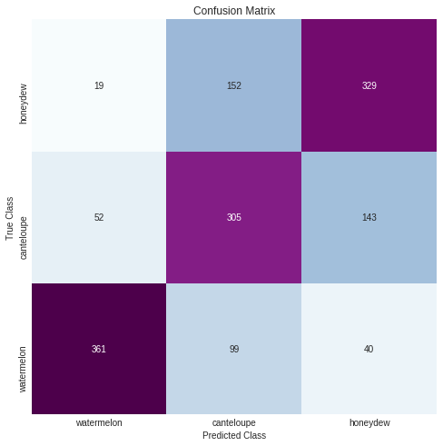
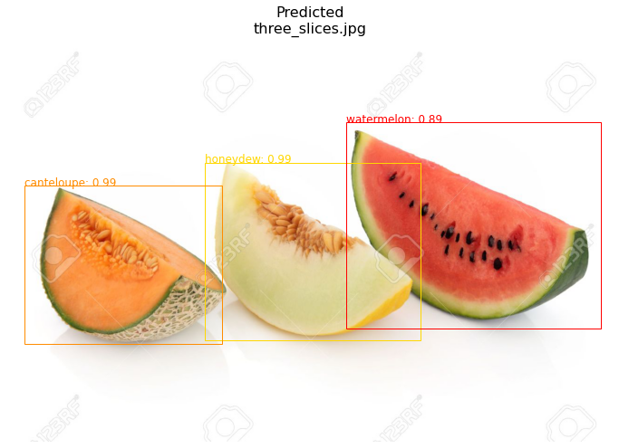
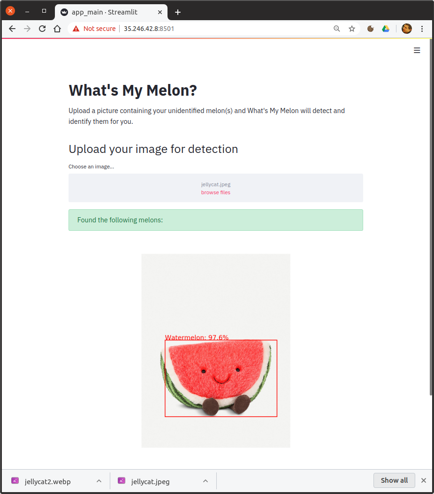
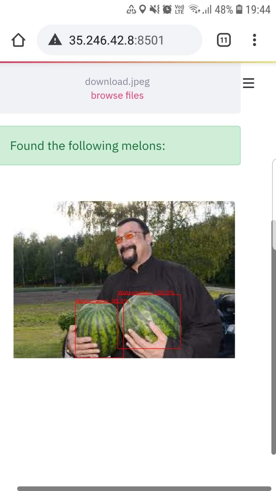

# What's My Melon?
## My Introduction to Convolutional Neural Networks - Melon Image Recognition

Try the app here: [What's My Melon Web App](http://35.234.153.136:8501/)  
Or try the Google Colabs prediction notebook here: [Colabs Notebook](https://colab.research.google.com/drive/1cdkwNh3GwsSvlErFpTw2jsq7CNLzJINi#scrollTo=CBy4mWuGDI_8&forceEdit=true&sandboxMode=true)

Following the [IBM AI Engineering Professional Certificate](https://www.coursera.org/professional-certificates/ai-engineer) course covering Keras and seeing an example of Convolutional Neural Networks (CNNs), I was keen to build a CNN project of my own. What I thought would take a few hours turned into a much deeper project as I quickly moved from a basic CNN to state of the art image-segmentation models.

This is how the project unfolded:
1. Web Scraper
2. First Attempt - Basic CNN
3. Second Attempt - Transfer Learning
4. Third Attempt - Mask-RCNN for Watermelon
5. Multiclass Mask-RCNN
6. Web App - Streamlit/Google Cloud
7. Next Steps

## 1. Web Scraper
I was keen to avoid pre-cleaned, nicely prepared datasets (Built-ins, Kaggle, etc.) as this isn't representative of real projects. It is useful to be able to generate your own datasets and I was keen to build a webscraper. For the basic CNN I was aiming to train on around 2000 images per class with 500 test images for evaluation.  
The initial scraper was built to extract links from Google image search and download the images from the sites. There is no API for extracting images so I built a scraper using Selenium. The initial scraper worked well until I updated Chrome and the HTML metadata had changed breaking the scraper. After a bit of searching I found that Google isn't the easiest site to scrape as they update quite regularly. Bing's HTML seemed to be more static and easier to read so I converted my scraper to use Bing instead. 

## 2. Basic CNN
The basic CNN was based on the lab from the Keras course in the [IBM AI Engineering Professional Certificate](https://www.coursera.org/professional-certificates/ai-engineer). Building the model and training it was straight-forward using the Keras ImageDataGenerator. I made a seperate script to evaluate the model and make new predictions.

Model Details:
- 3 classes: watermelon, honeydew, canteloupe
- 6600 training images and 1500 test images
- Uses 3 convolutional layers in Keras

You can see the notebooks here:
1. [Training Model](./melon_CNN.py)
2. [**Model Evaluation with Write-up**](./CNN_evaluate.ipynb)
3. [Prediction Notebook for you to test](./CNN_prediction.ipynb)
   *prediciton notebook requires model files which I haven't uploaded yet. 
  
  
  

## 3. Transfer Learning
Transfer learning uses a pre-trained CNN and allows you to only train the final layer. I had a quick attempt at transfer learning (which performed worse than the basic CNN), but had already come to the conclusion I needed an object detection model for busier images. 

## 4. Mask-RCNN
After testing the trained CNN on some obvious pictures of melons it did a good job of predicting the various types. The next step was to ask people to send pictures of melons for me to classify. I had overlooked the thought process of the general population and 80% of the images I received were similar to the one below:

  

This is when I realised the CNN wasn't doing a good job of predicting melons within an image. After a bit of research I realised I need to create an object detection or image segmentation model. Mask-RCNN is a state-of-the-art object detection model which uses the ResNet101 model architecture and can be used for transfer learning

I began setting up my model using the package [Matterport Mask R-CNN](https://github.com/matterport/Mask_RCNN) and the guides provided in the repository. Mask-RCNN is a state-of-the-art object detection model which uses the [ResNet101](https://www.cv-foundation.org/openaccess/content_cvpr_2016/papers/He_Deep_Residual_Learning_CVPR_2016_paper.pdf) model architecture and can be used for transfer learning using weights from the [COCO dataset.](http://cocodataset.org/) 

To create the image masks I chose 120 images of watermelons and created the masks using [VGG Image Annotator](http://www.robots.ox.ac.uk/~vgg/software/via/via.html) after manually checking the images I ended up with 80 training images and 20 test images. The model achieved a mean absolute precision of 97.5% on the test set.

1. [Mask-RCNN Training Notebook (Google Colabs)](./maskRCNN_colab_train.ipynb)
2. [**Model Evaluation and Write-up**](./maskRCNN_evaluate.ipynb)
3. [Prediciton Notebook](./maskRCNN_prediction.ipynb)
   *prediciton notebook requires model files which I haven't uploaded yet.  
   
  

## 5. Multi-class Mask-RCNN
I have extended the single class Mask RCNN to identify watermelons, canteloupes and honeydews. Due to the similarity of the images the model requires improvements - I'm still working on this. The third iteration is in the notebooks below. 

1. [Multi-class Mask-RCNN Training Notebook (Google Colabs)](./multi_maskRCNN_colab_train.ipynb)
2. [**Model Evaluation and Write-up**](./multi_maskRCNN_colab_eval.ipynb)
3. [Google Colabs Prediction Notebook](https://colab.research.google.com/drive/1cdkwNh3GwsSvlErFpTw2jsq7CNLzJINi#scrollTo=CBy4mWuGDI_8&forceEdit=true&sandboxMode=true)

   

## 6. Web App - Streamlit/Google Cloud

  

To implement the model I first set up a local web page using the dashboarding tool streamlit. This step was straight forward and streamlit is very easy to use. Getting the app online using a free tier service was a challenge and took three attempts.

[Streamlit Script](./app_main.py)

First: Heroku    
Heroku is a free web hosting app. The setup is through Git and you provide a few extra files to install required packages and a shell script to launch your app on the server. However, there is a limit to the size of your system and with the model weights file and required packages, I was above the limit.  

Second: Amazon Web Services    
This was a lot easier to set up and involves creating a linux virtual machine. I used EC2 to create the system, installed the required packages on the VM and launched the app. Again I was struggling with memory capacity on the free tier and the system was killing the predictions due to memory capacity.

Third: Google Cloud    
The Google Cloud procedure was quite similar to AWS. Google gives you a $300 limit to use over a year so I could use a system with higher specs. Setting up the VM took about 20 mins to get online. Streamlit uses port 8501 to display the webpage so I opened this port on the firewall settings and the app was ready to go. 
  
 Try the app here: [What's My Melon Web App](http://35.234.153.136:8501/)   

## 7. Next Steps
The model still requires fine tuning which I will work on. Mainly to increase the number of predictions for images containing lots of melons and a few misclassification cases. I also need to reduce false predictions for non-melons. 
I will also look into speeding up the predictions.

For now, I need a rest from melons...  

