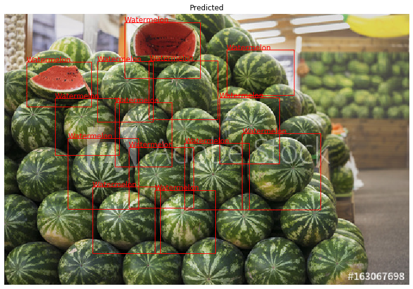
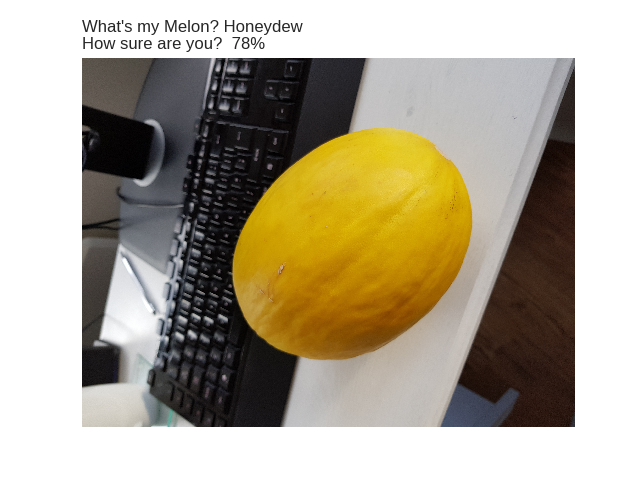
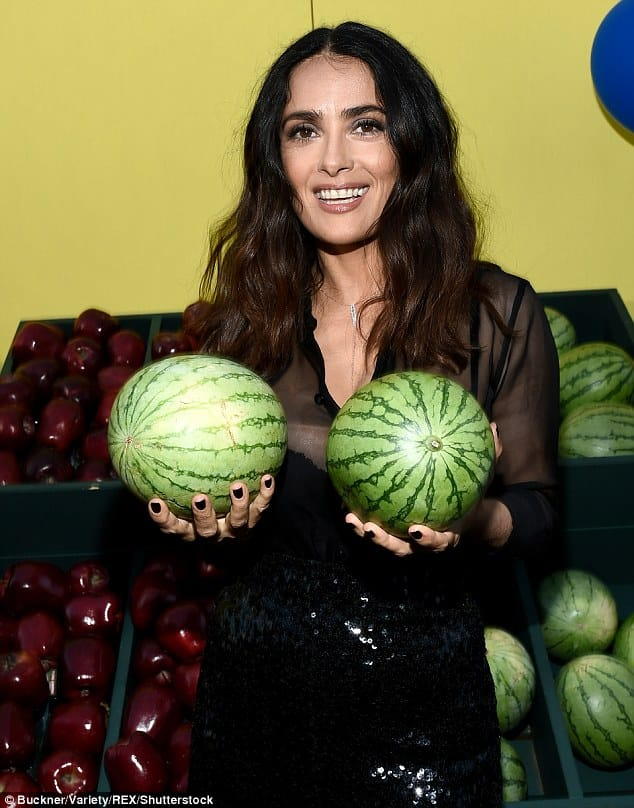

# What's My Melon?
## My Introduction to Convolutional Neural Networks - Melon Image Recognition

Following the [IBM AI Engineering Professional Certificate](https://www.coursera.org/professional-certificates/ai-engineer) course covering Keras and seeing an example of Convolutional Neural Networks (CNNs), I was keen to build a CNN project of my own. What I thought would take a few hours turned into a much deeper project as I quickly moved from a basic CNN to state of the art image-segmentation models.

This is how the project unfolded:
1. Web Scraper
2. First Attempt - Basic CNN
3. Second Attempt - Transfer Learning
4. Third Attempt - Mask-RCNN for Watermelon
5. Next Steps

## 1. Web Scraper
I was keen to avoid pre-cleaned, nicely prepared datasets (Built-ins, Kaggle, etc.) as this isn't representative of real projects. It is useful to be able to generate your own datasets and I was keen to build a webscraper. For the basic CNN I was aiming to train on around 2000 images per class with 500 test images for evaluation.  
The initial scraper was built to extract links from Google image search and download the images from the sites. There is no API for extracting images so I built a scraper using Selenium. The initial scraper worked well until I updated Chrome and the HTML metadata had changed breaking the scraper. After a bit of searching I found that Google isn't the easiest site to scrape as they update quite regularly. Bing's HTML seemed to be more static and easier to read so I converted my scraper to use Bing instead. 

## 2. Basic CNN
The basic CNN was based on the lab from the Keras course in the [IBM AI Engineering Professional Certificate](https://www.coursera.org/professional-certificates/ai-engineer). Building the model and training it was straight-forward using the Keras ImageDataGenerator. I made a seperate script to evaluate the model and make new predictions.

Model Details:
- 3 classes: watermelon, honeydew, canteloupe
- 2200 training images and 500 test images per class
- Uses 3 convolutional layers in Keras

You can see the notebooks here:
1. [Training Model](./CNN.py)
2. [Model Evaluation with Write-up](./CNN_evaluate.ipynb)
3. [Prediction Notebook for you to test](./CNN_prediction.ipynb)
   *prediciton notebook requires model files which I haven't uploaded yet. 
  

## 3. Transfer Learning
Transfer learning uses a pre-trained CNN and allows you to only train the final layer. I had a quick attempt at transfer learning (which performed worse than the basic CNN), but had already come to the conclusion I needed an object detection model for busier images. 

## 4. Mask-RCNN
After testing the trained CNN on some obvious pictures of melons it did a good job of predicting the various types. The next step was to ask people to send pictures of melons for me to classify. I had overlooked the thought process of the general population and 80% of the images I received were similar to the one below:

This is when I realised the CNN wasn't doing a good job of predicting melons within an image. After a bit of research I realised I need to create an object detection or image segmentation model. Mask-RCNN is a state-of-the-art object detection model which uses the ResNet101 model architecture and can be used for transfer learning

I began setting up my model using the package [Matterport Mask R-CNN](https://github.com/matterport/Mask_RCNN) and the guides provided in the repository. Mask-RCNN is a state-of-the-art object detection model which uses the [ResNet101](https://www.cv-foundation.org/openaccess/content_cvpr_2016/papers/He_Deep_Residual_Learning_CVPR_2016_paper.pdf) model architecture and can be used for transfer learning using weights from the [COCO dataset.](http://cocodataset.org/) 

To create the image masks I chose 120 images of watermelons and created the masks using [VGG Image Annotator](http://www.robots.ox.ac.uk/~vgg/software/via/via.html) after manually checking the images I ended up with 80 training images and 20 test images. 

1. [Mask-RCNN Training Notebook (Google Colabs)](./maskRCNN_colab_train.ipynb)
2. [Evaluation and Write-up](./maskRCNN_evaluate.ipynb)
3. [Prediciton Notebook](./maskRCNN_prediction.ipynb)
   *prediciton notebook requires model files which I haven't uploaded yet. 
   
   

## 5. Next Steps
The next step is to train a multiclass Mask RCNN on watermelon, honeydew and canteloupe and then productionise the model through a webpage or app where the user can upload or take a photo and detect any melons in the image. I'll update the project when it is ready!
